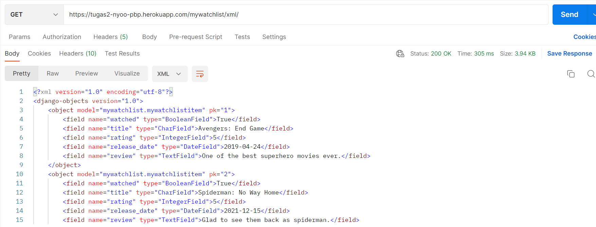
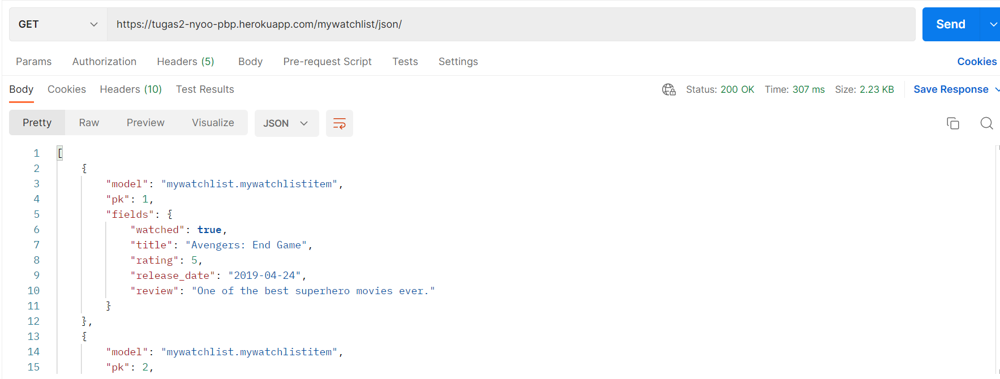
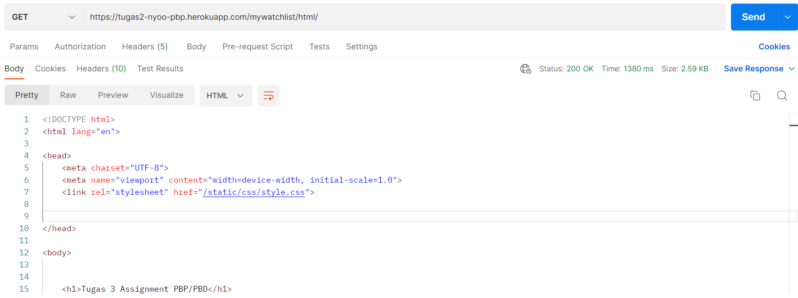

# PBP Assignment 3 

Nama    : Nyoo Steven Christopher
NPM     : 2106630050
Kelas   : PBP-D
Link aplikasi di Heroku : [Link](https://tugas2-nyoo-pbp.herokuapp.com/mywatchlist/)

## JSON, XML, HTML
### JSON
Json adalah singkatan dari JavaScript Object Notation merupakan suatu format yang digunakan untuk menyimpan, membaca, serta menukar informasi dari web server sehingga dapat dibaca oleh para pengguna.

### XML
Extensible Markup Language (XML) adalah bahasa komputer yang dibuat oleh World Wide Web Consortium (W3C) untuk menyederhanakan proses pertukaran dan penyimpanan data. XML akan menyimpan data dalam format teks yang sederhana. Jadi, data tersebut akan dapat dimengerti oleh server yang menerima data tanpa perlu perubahan atau modifikasi apapun. Hal ini tentunya sangat memudahkan dalam penyimpanan dan pengiriman data antar server.

### HTML
HTML adalah singkatan dari Hypertext Markup Language, yaitu bahasa markup standar untuk membuat dan menyusun halaman dan aplikasi web. Penggunaan umum HTML adalah untuk menyusun bagian paragraf, heading, maupun link pada halaman web. Tapi, meskipun susunannya seperti coding, perlu diketahui bahwa HTML bukanlah bahasa pemrograman.

### Perbedaan JSON, XML, dan HTML
JSON adalah format data sedangkan XML adalah bahasa markup. XML digunakan untuk menyimpan dan mengangkut data dari satu aplikasi ke aplikasi lain melalui Internet. JSON di sisi lain adalah format pertukaran data ringan yang jauh lebih mudah bagi komputer untuk mengurai data yang sedang dikirim.

Format JSON menggambarkan diri sendiri dan secara komparatif jauh lebih mudah dibaca daripada dokumen berformat XML. Jika sebuah proyek memerlukan markup dokumen dan informasi metadata, lebih baik menggunakan XML. Sedangkan HTML sendiri, merepresentasikan data dalam bentuk element tree, tetapi data yang direpresentasikan lebih ditujukan untuk ditampilkan pada web browser.

## Mengapa memperlukan data delivery
Pertukaran data biasanya diperlukan dalam pengimplementasian sebuah platform. Mmetode data delivery digunakan untuk membantu mempermudah proses pertukaran data menjadi lebih mudah. Penggunaan metode data delivery seperti JSON, XML, dan HTML dapat mempermudah pekerjaan para developer.

## Penjelasan Implementasi
### Prerequiste
Sebelumnya Anda harus memiliki sbuah aplikasi bernama `mywatchlist app`. Setelah itu user akan mencari route, mana yang akan dipilih, untuk kasus ini pilih route `mywatchlist`. 

### Fixtures
Masukan database yang akan ditampilkan di display. Jangan lupa load database tersebut.
```jsonld
{
        "model": "mywatchlist.mywatchlistItem",
        "pk": 1,
        "fields": {
            "watched": true,
            "title": "Avengers: End Game",
            "rating": 5,
            "release_date": "2019-04-24",
            "review": "One of the best superhero movies ever."
        }
    },
    {
        "model": "mywatchlist.mywatchlistItem",
        "pk": 2,
        "fields": {
            "watched": true,
            "title": "Spiderman: No Way Home",
            "rating": 5,
            "release_date": "2021-12-15",
            "review": "Glad to see them back as spiderman."
        }
    },
```

### urls.py
Menambahkan beberapa path yang ada termasuk html, xml, json.
```python=
urlpatterns = [
    path('', show_watchlist, name='show_watchlist'),
    path('html/', show_watched, name='show_watched'),
    path('xml/', show_xml, name='show_xml'),
    path('json/', show_json, name='show_json'),
    path('json/<int:id>', show_json_by_id, name='show_json_by_id'),
    path('xml/<int:id>', show_xml_by_id, name='show_xml_by_id'),
]
```
### views.py
Menambahkan beberapa fungsi views.py beberapa untuk render
```python=
def show_watchlist(request):
    return render(request, "mywatchlist1.html")

def show_watched(request):
    list_mywatchlist = mywatchlistItem.objects.all() 
    movie_sum = list_mywatchlist.count()
    
    nonton = 0
    for movie in list_mywatchlist:
        if (movie.watched): 
            nonton += 1

    if 2*nonton > movie_sum : 
        result = "Selamat, kamu sudah banyak menonton!"
    else : 
        result = "Wah, kamu masih sedikit menonton!"   

    context = {
        'list_mywatchlist': list_mywatchlist,
        'nama': 'Nyoo Steven',
        'npm' : '2106630050',
        'result': result
    }
    return render(request, "mywatchlist.html", context)

def show_json(request):
    list_mywatchlist = mywatchlistItem.objects.all()
    return HttpResponse(serializers.serialize("json", list_mywatchlist), content_type="application/json")

def show_xml(request):
    list_mywatchlist = mywatchlistItem.objects.all()
    return HttpResponse(serializers.serialize("xml", list_mywatchlist), content_type="application/xml")

def show_json_by_id(request, id):
    list_mywatchlist = mywatchlistItem.objects.filter(pk=id)
    return HttpResponse(serializers.serialize("json", list_mywatchlist), content_type="application/json")

def show_xml_by_id(request, id):
    list_mywatchlist = mywatchlistItem.objects.filter(pk=id)
    return HttpResponse(serializers.serialize("xml", list_mywatchlist), content_type="application/xml")
```
## POSTMAN
### XML

### JSON

### HTML
